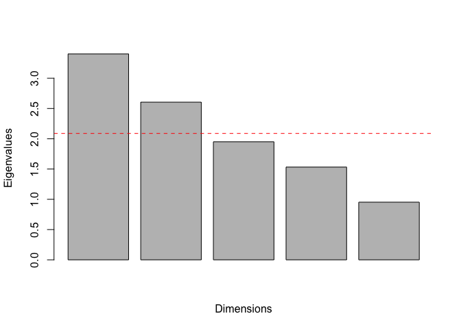

### Import the data

``` r
vir <- read.csv("PhotosynQ_All_Data.csv")
str(vir)
```

    ## 'data.frame':    96 obs. of  50 variables:
    ##  $ Pass            : int  15 15 15 15 15 15 15 15 15 15 ...
    ##  $ Range           : int  21 21 22 22 23 23 24 24 25 25 ...
    ##  $ Sample          : int  1 2 3 4 5 6 7 8 9 10 ...
    ##  $ section         : Factor w/ 4 levels "NE","NW","SE",..: 4 4 4 4 4 4 4 4 2 2 ...
    ##  $ V3.DW           : num  0.63 0.75 0.6 0.77 0.79 0.63 0.93 0.91 0.69 0.55 ...
    ##  $ R5.DW           : num  4.41 4.76 8.07 6.48 3.78 5.68 5.45 3.06 5.74 4.97 ...
    ##  $ V3.foliar       : num  0 0 0 0 0 0 0 0 0 0 ...
    ##  $ V3.root         : num  15 5 26.7 11.7 5 ...
    ##  $ R5.foliar       : num  1.33 0.33 0 0 0.33 0 0.5 2.33 0 0 ...
    ##  $ R5.root         : num  3.33 10 0 0 16.67 ...
    ##  $ R4.DI           : int  0 0 0 0 0 0 0 20 5 0 ...
    ##  $ R4.DS           : num  0 0 0 0 0 0 0 1 1 0 ...
    ##  $ R4.DX           : num  0 0 0 0 0 0 0 2.22 0.56 0 ...
    ##  $ R5.DI           : int  5 1 0 0 0 0 5 75 5 0 ...
    ##  $ R5.DS           : num  1.5 1 0 0 0 0 1.5 3 1 0 ...
    ##  $ R5.DX           : num  0.83 0.11 0 0 0 0 0.83 25 0.56 0 ...
    ##  $ R6.DI           : int  50 40 20 15 30 10 25 70 10 30 ...
    ##  $ R6.DS           : num  3 2.5 1.5 1.5 2 3 1.5 4.5 2 1.5 ...
    ##  $ R6.DX           : num  16.67 11.11 3.33 2.5 6.67 ...
    ##  $ PreSCN.cysts    : int  14 21 12 12 13 5 18 42 27 13 ...
    ##  $ PreSCN.eggs     : int  1140 1600 860 860 820 320 1280 3200 2080 880 ...
    ##  $ PreSCN.juvs     : int  200 240 60 100 100 20 240 480 400 140 ...
    ##  $ PostSCN.cysts   : int  15 29 13 13 7 8 33 22 7 51 ...
    ##  $ PostSCN.eggs    : int  3000 1880 1200 1120 560 840 1240 1680 680 2000 ...
    ##  $ PostSCN.juvs    : int  640 440 200 320 100 80 200 280 80 480 ...
    ##  $ PostSCN.eggsjuvs: int  3640 2320 1400 1440 660 920 1440 1960 760 2480 ...
    ##  $ PostSCN.total   : int  3655 2349 1413 1453 667 928 1473 1982 767 2531 ...
    ##  $ PhotosynQ       : num  0.1 0.13 0.17 0.21 0.23 0.16 0.16 0.1 0.13 0.23 ...
    ##  $ Pre.qPCR        : num  463 536 618 941 590 ...
    ##  $ V3.qPCR         : num  7.58 6.42 8.21 10 10.8 ...
    ##  $ R5.qPCR         : num  6.81 7.35 6.76 7.35 6.7 ...
    ##  $ Post.qPCR       : num  563 520 424 297 230 ...
    ##  $ Yield           : num  36.5 36.5 42 42 40.8 ...
    ##  $ V3.Phi2         : num  0 0.00247 0.0111 0.01352 0.01357 ...
    ##  $ V3.PhiNPQ       : num  0 0.0456 0.0226 -0.0216 0.0123 ...
    ##  $ V3.PhiNO        : num  0 -0.04873 -0.03349 0.00681 -0.02685 ...
    ##  $ V3.SPAD         : num  0 1.18 1.08 3.64 3.32 4.18 1.08 1.84 2.42 5.94 ...
    ##  $ V3.NPQt         : num  0 0.33 0.203 -0.118 0.14 ...
    ##  $ V3.LEF          : num  0 1.4 7.39 7.96 7.43 ...
    ##  $ V3.qL           : num  0 0.03411 0.02564 0.00979 0.0338 ...
    ##  $ R1.Phi2         : num  0 0.0195 0.0178 0.021 0.0406 ...
    ##  $ R1.PhiNPQ       : num  0 0.00412 -0.0347 -0.02573 -0.06934 ...
    ##  $ R1.PhiNO        : num  0 -0.02561 0.01385 0.00303 0.02437 ...
    ##  $ R1.SPAD         : num  0 2.283 2.233 0.517 1.717 ...
    ##  $ R1.NPQt         : num  0 0.183 -0.245 -0.147 -0.401 ...
    ##  $ R1.LEF          : num  0 -1.5976 2.416 -0.0152 4.9205 ...
    ##  $ R1.qL           : num  0 0.08411 0.00821 0.03931 0.041 ...
    ##  $ Pre.spiral      : int  4 0 8 8 0 24 16 24 24 0 ...
    ##  $ Pre.lesion      : int  0 0 0 20 8 0 0 16 8 24 ...
    ##  $ Pre.dagger      : int  0 0 0 0 0 0 0 0 0 0 ...

``` r
sample <- vir$Sample
direction <- vir$section

var <- vir[,-c(1:3)]
nrow(var)
```

    ## [1] 96

Principle Coordinates analysis
------------------------------

``` r
library(ape)
```

    ## Warning: package 'ape' was built under R version 3.2.3

``` r
library(ecodist)
pre.plantvar <- grep("Pre", names(var))
pre.plant <- var[,pre.plantvar]
#pre.plant <- cbind(pre.plant, pam.clust.R5$V5)
pre.plant.pca <- pre.plant[,c(-1,-2)]
n = nrow(pre.plant.pca)
p = ncol(pre.plant.pca)
rank.pre = min(n,p)

# apply PCA - scale. = TRUE is highly 
# advisable, but default is FALSE. 
vir.pca <- prcomp(scale(pre.plant.pca, center = TRUE, scale = TRUE)) 
vir.pca$sdev/sum(vir.pca$sdev)
```

    ## [1] 0.2681314 0.2278065 0.2091860 0.1578858 0.1369903

``` r
loadings <- vir.pca$rotation
loadings
```

    ##                    PC1        PC2          PC3         PC4        PC5
    ## PreSCN.juvs -0.4931155  0.4787834  0.006469029 -0.69405373  0.2141286
    ## Pre.qPCR    -0.3686071  0.6367306 -0.076818160  0.66009037 -0.1307008
    ## Pre.spiral  -0.5454191 -0.4522658  0.132854154  0.27325987  0.6369085
    ## Pre.lesion  -0.5624276 -0.4007209 -0.228777168 -0.08886468 -0.6803396
    ## Pre.dagger  -0.0846109  0.0147977  0.961284507 -0.00149502 -0.2618242

``` r
scores <- as.data.frame(vir.pca$x)
summary(vir.pca)
```

    ## Importance of components:
    ##                           PC1    PC2    PC3    PC4     PC5
    ## Standard deviation     1.3045 1.1083 1.0177 0.7681 0.66647
    ## Proportion of Variance 0.3403 0.2457 0.2072 0.1180 0.08884
    ## Cumulative Proportion  0.3403 0.5860 0.7932 0.9112 1.00000

``` r
delta = function(D) {
  DD=as.matrix(D)
  n=nrow(DD)
  d=matrix(0,n,n)
  A=-0.5*(DD^2)
  Arm = rowMeans(A)
  Acm = colMeans(A)
  Agm = mean(A)
  
  for (i in 1:n) {
    for (j in 1:n) {
      d[i,j] = A[i,j] - Arm[i] - Acm[j] + Agm
    }}
  return(d)
}

library(vegan)
```

    ## Warning: package 'vegan' was built under R version 3.2.3

    ## Loading required package: permute

    ## Warning: package 'permute' was built under R version 3.2.3

    ## Loading required package: lattice

    ## This is vegan 2.3-3

    ## 
    ## Attaching package: 'vegan'

    ## The following object is masked from 'package:ecodist':
    ## 
    ##     mantel

``` r
pre.bray <- vegdist(pre.plant.pca, method = "bray")
e.bray <- eigen(delta(pre.bray))
barplot(e.bray$values[1:rank.pre])
```

<!-- -->

``` r
#Now calculate the eigenvectors of the delta matrix
pre.cmd <- cmdscale(pre.bray, k = rank.pre, eig = TRUE)

prop.pre <- as.matrix((pre.cmd$eig/sum(pre.cmd$eig))*100)
prop.pre[1:rank.pre]
```

    ## [1] 70.943047 16.267962  7.660185  5.518836  3.505549

``` r
barplot(pre.cmd$eig[1:rank.pre], main="",
   xlab="Dimensions", ylab = "Eigenvalues")
lines(pre.cmd$values)
abline(h = mean(pre.cmd$eig[1:rank.pre]), col = "red", lty = 2)
```

<!-- -->

``` r
pre.pco <- as.data.frame(pre.cmd$points)
pre.pco$section <- vir$section
biplot(pcoa(pre.bray))
```

<!-- -->

``` r
library(ggplot2)
plot3 <- ggplot(pre.pco, aes(x = V1, y = V2, color = section)) + 
  geom_vline(xintercept = 0) +
  geom_hline(yintercept = 0) +
  geom_point(size = 5) +
  xlab("Axis1 (71%)") +
  ylab("Axis2 (16%)") + 
  theme_bw() 
  #theme(axis.text.x = element_text(size = 10, face = "bold"),
   #     axis.text.y = element_text(size = 10, face = "bold"),
    #    axis.title.x = element_text(size = 20, face = "bold"),
     #   axis.title.y = element_text(size = 20, face = "bold"),
      #  legend.title = element_text(size  = 0, face = "bold"),
       # legend.text = element_text(size  = 20, face = "bold.italic"))
plot.1 <- as.data.frame(cbind(pre.plant.pca$PreSCN.juvs, pre.pco$V1))
plot1 <- ggplot(plot.1, aes(x = V1, y = V2, color = var$R5.DX )) + 
  geom_point(size = 3) + 
  stat_smooth(color = "black", se = FALSE) + 
  scale_colour_gradient(name = "Disease\nIndex R5", low="forestgreen", high = "red") + 
  xlab("Pre soil SCN juviniles") +
  ylab("PcoA1 (71%)") +
  theme_bw()
plot.2 <- as.data.frame(cbind(pre.plant.pca$Pre.qPCR, pre.pco$V1, pre.pco$V2))
plot2 <- ggplot(plot.2, aes(x = V1, y = V2, color = var$R5.DX )) + 
  geom_point(size = 3) + 
  scale_colour_gradient(name = "Disease\nIndex R5", low="forestgreen", high = "red") + 
  stat_smooth(color = "black", se = FALSE) + 
  xlab("Pre soil qPCR") +
  ylab("PcoA1 (71%)") +
  theme_bw()

library(gridExtra)
grid.arrange(plot3, arrangeGrob(plot2, plot1, ncol = 2))
```

<!-- -->

``` r
pre.qpcr1 <- cor(pre.plant.pca$Pre.qPCR, pre.pco$V1)
pre.juv1 <- cor(pre.plant.pca$PreSCN.juvs, pre.pco$V1)
pre.spiral1 <- cor(pre.plant.pca$Pre.spiral, pre.pco$V1)
pre.lesion1 <-  cor(pre.plant.pca$Pre.lesion, pre.pco$V1)
pre.dagger1 <-  cor(pre.plant.pca$Pre.dagger, pre.pco$V1)
pre.qpcr2 <- cor(pre.plant.pca$Pre.qPCR, pre.pco$V2)
pre.juv2 <- cor(pre.plant.pca$PreSCN.juvs, pre.pco$V2)
pre.spiral2 <- cor(pre.plant.pca$Pre.spiral, pre.pco$V2)
pre.lesion2 <-  cor(pre.plant.pca$Pre.lesion, pre.pco$V2)
pre.dagger2 <- cor(pre.plant.pca$Pre.dagger, pre.pco$V2)
pre.qpcr3 <- cor(pre.plant.pca$Pre.qPCR, pre.pco$V3)
pre.juv3 <- cor(pre.plant.pca$PreSCN.juvs, pre.pco$V3)
pre.spiral3 <- cor(pre.plant.pca$Pre.spiral, pre.pco$V3)
pre.lesion3 <-  cor(pre.plant.pca$Pre.lesion, pre.pco$V3)
pre.dagger3 <- cor(pre.plant.pca$Pre.dagger, pre.pco$V3)

data.frame1 <- data.frame(c(pre.qpcr1, pre.juv1, pre.spiral1, pre.lesion1, pre.dagger1))
data.frame2 <- data.frame(c(pre.qpcr2, pre.juv2, pre.spiral2, pre.lesion2, pre.dagger2))
data.frame3 <- data.frame(c(pre.qpcr3, pre.juv3, pre.spiral3, pre.lesion3, pre.dagger3))

corelations <- cbind.data.frame(data.frame1, data.frame2, data.frame3)
colnames(corelations) <- c("Dim1", "Dim2", "Dim3")
rownames(corelations) <- c("qPCR", "SCN", "Spiral", "Lesion", "Dagger")
library(knitr)
```

    ## Warning: package 'knitr' was built under R version 3.2.3

``` r
kable(corelations)
```

|        |       Dim1|        Dim2|        Dim3|
|--------|----------:|-----------:|-----------:|
| qPCR   |  0.8380665|  -0.5205832|   0.0056947|
| SCN    |  0.7879208|   0.5327588|  -0.0356407|
| Spiral |  0.1946473|   0.1918144|   0.1052310|
| Lesion |  0.2393085|   0.2311228|   0.0356229|
| Dagger |  0.0674872|   0.0835663|   0.0181472|

### Canonical correlation analysis

``` r
options(scipen = 999) # stops anything from being in scientific notation

#Canonical Correlation Analysis (CCA)
pre.plantvar <- grep("Pre", names(var))
pre.plant <- var[,pre.plantvar]

R5.plantvar <- grep("R5", names(var))
R5.plant <- var[,R5.plantvar]
R5.plant <- R5.plant[,c(1:6)]

disease <- data.frame(R5.plant[,c(1,2,3)])
pre <- pre.plant[,-c(1,2)]

#install.packages("yacca")
library(yacca)
```

    ## 
    ## Attaching package: 'yacca'

    ## The following object is masked from 'package:vegan':
    ## 
    ##     cca

``` r
cca <- cca(pre, disease)
cca$chisq
```

    ##      CV 1      CV 2      CV 3 
    ## 54.130946 18.166115  7.344583

``` r
cca$df
```

    ## CV 1 CV 2 CV 3 
    ##   15    8    3

``` r
pchisq(cca$chisq[1],cca$df[1],lower.tail = F)
```

    ##           CV 1 
    ## 0.000002497663

``` r
pchisq(cca$chisq[2],cca$df[2],lower.tail = F)
```

    ##     CV 2 
    ## 0.020015

``` r
pchisq(cca$chisq[3],cca$df[3],lower.tail = F)
```

    ##       CV 3 
    ## 0.06168917

``` r
pchisq(cca$chisq[4],cca$df[4],lower.tail = F)
```

    ## <NA> 
    ##   NA

``` r
-cca$xstructcorr[,1]
```

    ## PreSCN.juvs    Pre.qPCR  Pre.spiral  Pre.lesion  Pre.dagger 
    ##  0.94141253  0.51178917 -0.02633386 -0.09556726  0.15302870

``` r
-cca$xstructcorr[,2]
```

    ## PreSCN.juvs    Pre.qPCR  Pre.spiral  Pre.lesion  Pre.dagger 
    ##  -0.1771668   0.3998948   0.3772380  -0.2394357   0.6614294

``` r
-cca$ystructcorr[,1]
```

    ##      R5.DW  R5.foliar    R5.root 
    ## -0.5430657  0.8049481  0.8811459

``` r
-cca$ystructcorr[,2]
```

    ##      R5.DW  R5.foliar    R5.root 
    ##  0.5738460  0.4713794 -0.4717497

``` r
F.test.cca(cca)
```

    ## 
    ##  F Test for Canonical Correlations (Rao's F Approximation)
    ## 
    ##          Corr        F   Num df Den df     Pr(>F)    
    ## CV 1  0.57266  3.92468 15.00000 243.33 0.00000253 ***
    ## CV 2  0.33571  2.34904  8.00000 178.00    0.02004 *  
    ## CV 3  0.27919  2.53619  3.00000  90.00    0.06170 .  
    ## ---
    ## Signif. codes:  0 '***' 0.001 '**' 0.01 '*' 0.05 '.' 0.1 ' ' 1

Plotting the CCA analysis

``` r
cca.bar.X1 <- data.frame(as.vector(cca$xstructcorr[,1]), "X", "Dim1", names(cca$xstructcorr[,1]))
colnames(cca.bar.X1) <- c("CV", "Axis", "Dim", "Var")
cca.bar.X2 <- data.frame(as.vector(cca$xstructcorr[,2]), "X", "Dim2", names(cca$xstructcorr[,2]))
colnames(cca.bar.X2) <- c("CV", "Axis", "Dim", "Var")
cca.bar.Y1 <- data.frame(as.vector(cca$ystructcorr[,1]), "Y", "Dim1", names(cca$ystructcorr[,1]))
colnames(cca.bar.Y1) <- c("CV", "Axis", "Dim", "Var")
cca.bar.Y2 <- data.frame(as.vector(cca$ystructcorr[,2]), "Y", "Dim2", names(cca$ystructcorr[,2]))
colnames(cca.bar.Y2) <- c("CV", "Axis", "Dim", "Var")

cca.bar <- rbind.data.frame(cca.bar.X1, cca.bar.X2, cca.bar.Y1, cca.bar.Y2)

#Is there increasing nematode diversity and virguliforme numbers with incrasing disease??
points1 <- data.frame(cca$canvary[,1], cca$canvarx[,1], R5.plant$R5.DX, vir$section)
colnames(points1) <- c("y", "x", "R5.DX", "Section")
points2 <- data.frame(cca$canvary[,2], cca$canvarx[,2], R5.plant$R5.DX, vir$section)
colnames(points2) <- c("y", "x", "R5.DX", "Section")
library(ggplot2)
p3 <- ggplot(points1, aes(y = -y, x = -x, color = Section)) + 
  geom_point(size = 4) + 
  xlab(expression("CCA X"[1])) + 
  ylab(expression("CCA Y"[1])) +
  theme_bw() +
  ggtitle("Dimension 1")
p4 <- ggplot(points2, aes(y = -y, x = -x, color = Section)) + 
  geom_point(size = 4) + 
  xlab(expression("CCA X"[2])) + 
  ylab(expression("CCA Y"[2])) +
  theme_bw() + 
  ggtitle("Dimension 2")
p1 <- ggplot(cca.bar[cca.bar$Dim == "Dim1",], aes(x = Var, y = -CV)) + 
  geom_bar(aes(fill = Axis), stat = "identity", position = "dodge") +
  coord_flip() +
  ggtitle("Dimension 1") + 
  scale_x_discrete(labels = c("R5.root" = "Root Rot","R5.foliar" = "Foliar", "R5.DX" = "Disease Index", 
                              "R5.DW" = "Root Dry Weight", "PreSCN.juvs" = "Soybean Cyst Nematode", "Pre.spiral" = "Spiral Nematodes", "Pre.qPCR" = "F. virguliforme", "Pre.lesion" = "Lesion Nematode", "Pre.dagger" = "Dagger Nematodes")) +
  xlab("Variables") + 
  ylab("Loadings") + 
  theme_bw()
p2 <- ggplot(cca.bar[cca.bar$Dim == "Dim2",], aes(x = Var, y = -CV)) + 
  geom_bar(aes(fill = Axis), stat = "identity", position = "dodge") +
  ggtitle("Dimension 2") + 
  scale_x_discrete(labels = c("R5.root" = "Root Rot","R5.foliar" = "Foliar", "R5.DX" = "Disease Index", 
                              "R5.DW" = "Root Dry Weight", "PreSCN.juvs" = "Soybean Cyst Nematode", "Pre.spiral" = "Spiral Nematodes", "Pre.qPCR" = "F. virguliforme", "Pre.lesion" = "Lesion Nematode", "Pre.dagger" = "Dagger Nematodes")) +
  xlab("Variables") + 
  ylab("Loadings") + 
  coord_flip() +
  theme_bw()
library(Rmisc)
```

    ## Loading required package: plyr

``` r
multiplot(p1, p3, p2, p4, cols = 2)
```

<!-- -->
