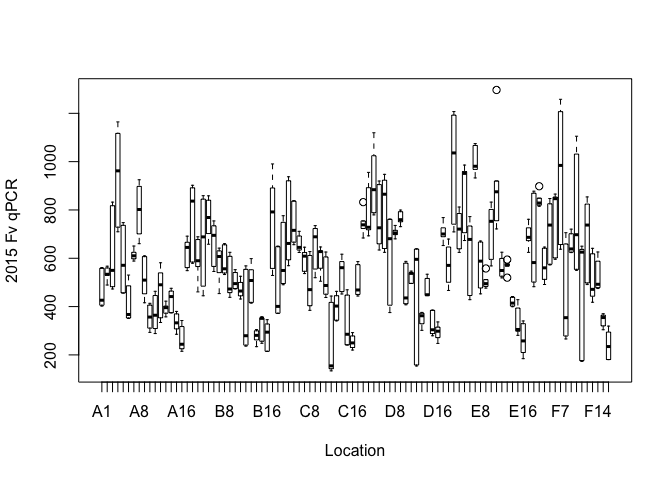
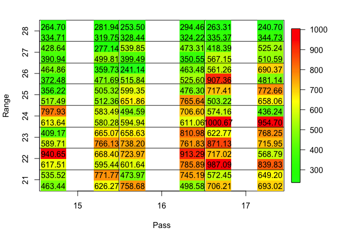
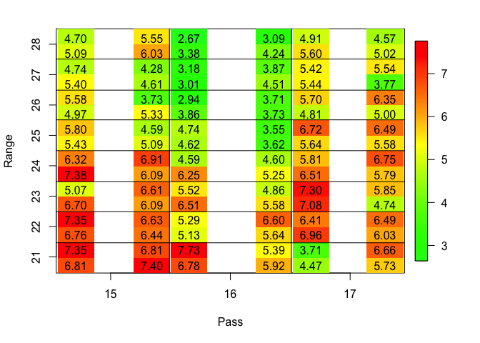
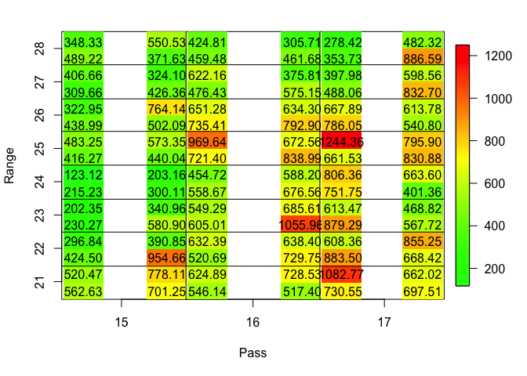

# qPCR Analysis
Mitch Roth  
April 28, 2016  

##Pre-planting soil samples
The following analysis is for the DNA extracted from soil samples collected prior to planting. There are 96 sampling points, with 3 DNA extraction replicates and 2 technical replicates per extraction replicate, totaling 6 replicates per sampling point.

First, examine the qPCR quantity distributions for each location to identify potential outliers.

```r
library(gtools)
setwd("~/Desktop/Chilvers Lab/_Projects/PPRA Decatur/2015 Data/qPCR/PreSoil")
all_qPCR <- read.table("2015_PPRA_PreSoil.csv", header=TRUE, sep=",")

#Parse each data point out by location
location <- matrix(data = all_qPCR$Sample)
pre_qPCR <- matrix(data=all_qPCR$Quantity)
#Organize locations from A1 to A16, B1 to B16, etc.
location <- as.integer(
              factor(
                all_qPCR$Sample,
                  c("A1","A2","A3","A4","A5","A6","A7","A8",
                    "A9","A10","A11","A12","A13","A14","A15","A16",
                    "B1","B2","B3","B4","B5","B6","B7","B8",
                    "B9","B10","B11","B12","B13","B14","B15","B16",
                    "C1","C2","C3","C4","C5","C6","C7","C8",
                    "C9","C10","C11","C12","C13","C14","C15","C16",
                    "D1","D2","D3","D4","D5","D6","D7","D8",
                    "D9","D10","D11","D12","D13","D14","D15","D16",
                    "E1","E2","E3","E4","E5","E6","E7","E8",
                    "E9","E10","E11","E12","E13","E14","E15","E16",
                    "F1","F2","F3","F4","F5","F6","F7","F8",
                    "F9","F10","F11","F12","F13","F14","F15","F16")
                )
              )
```

Now, visualize the qPCR data by location via boxplots
\

From this plot, it looks like location A6 has an outlier in at least one of the qPCR quantities, potentially due to the DNA extraction.  
I will re-do a DNA extraction from this soil sample and re-run the qPCR analysis as well, at a later date.


Now I want to generate a heatmap that represents the physical location of the sample points, with the colors of the heat map corresponding to the quantity of F. virguliforme DNA present at the location

First, import the data from the All Data file and parse out the variables.
For this analysis, I will only parse out Pre.qPCR as an example.

```r
library(fields)
library(gstat)
library(spatial)
library(sp)
library(geoR)
```

```
## Warning: running command ''/usr/bin/otool' -L '/Library/Frameworks/
## R.framework/Resources/library/tcltk/libs//tcltk.so'' had status 1
```

```r
setwd("~/Desktop/Chilvers Lab/_Projects/PPRA Decatur/2015 Data")
All_Data <- read.table("2015 All Data.csv", header=TRUE, sep=",")

#Parse out variable(s) from the "All Data" file
Pre.qPCR <- matrix(data=All_Data$Pre.qPCR, ncol = 6, nrow = 16)
```

Now, the following function(s) will generate:
  1. An 8x3 grid with pass and range labels of the field plot
  2. A colored map corresponding to the sampled data
  3. Values overlayed onto the colors
  4. A color map legend (?)
Note 1: The data must be transposed in order to be oriented correctly (North, South, East, West)
Note 2: Red colors always mean "bad for the plant".

```r
y <- c(1.45, 3.2, 4.05, 6, 6.85, 8.55)
heatmap.t <- function(var){
  Pass <- 1:9
  Range <- 1:9
  Passlab <- c("15", "16", "17")
  Rangelab <- c("21", "22", "23", "24", "25", "26", "27", "28")
  par(mar=c(5.1, 4.1, 2.1, 5.5))
  plot(Pass,Range, xaxt = "n", yaxt="n", xaxs = "i", pch=NA, title(""))
  axis(side=2, at=seq(1.25,9,1.075), labels = Rangelab)
  axis(side=1, at=seq(2.25,9,2.75), labels = Passlab)
  for (i in seq_along(y)){
    tvar <- t(var)
    tvarcol <- matrix(tvar[i,], nrow = 1, ncol = 16)
    add.image(y[i], 5, tvarcol, 
              zlim=c(min(tvar), max(tvar)), axes=FALSE,
              image.width = 1, image.height = 0.15, 
              col = rev(rainbow(100, start = 1, end = 0.35)))
    text(y[i], y = (at = seq(0.95,9,0.535)), 
          labels = format(round((tvar[i,]), 2), nsmall = 2))
  }
  abline(v=c(3.6, 6.4))
  abline(a=1.75, b=0)
  abline(a=2.85, b=0)
  abline(a=3.91, b=0)
  abline(a=5.01, b=0)
  abline(a=6.1, b=0)
  abline(a=7.15, b=0)
  abline(a=8.25, b=0)
  image.plot(var, col = rev(rainbow(100, start = 1, end = 0.35)), legend.only = TRUE, zlim=c(min(var), max(var)), axes=FALSE)
}
heatmap.t(Pre.qPCR)
```

\

As with the boxplots, it looks like A6 is an outlier (1241.9624)

#V3 and R5 plant samples
The following analysis is for the DNA extracted from root samples collected soybean plants at stage V3 or R5. Three plants were collected and combined for each of the 96 sampling points. 

The quantity of F. virguliforme DNA was calculated via the deltaCt method. Therefore, each sample is compared to itself as a ratio of infection, and a general quantity distribution does not need to be checked.

Instead, go straight to generating heatmaps.
Note: Red colors always mean "bad for the plant"

```r
library(gtools)
setwd("~/Desktop/Chilvers Lab/_Projects/PPRA Decatur/2015 Data")
All_Data <- read.table("2015 All Data.csv", header=TRUE, sep=",")
V3.qPCR <- matrix(All_Data$V3.qPCR, ncol = 6, nrow = 16)
R5.qPCR <- matrix(All_Data$R5.qPCR, ncol = 6, nrow = 16)

#Use the same y vector and heatmap.t function as above
heatmap.t(V3.qPCR)
```

\

```r
heatmap.t(R5.qPCR)
```

\

It does not look like there is a useful correlation between F. virguliforme quantity in roots and visual SDS symptoms (SDS symptoms from memory)


#Post-harvest soil samples
The following analysis is for the DNA extracted from soil samples collected after harvest. There are 96 sampling points, with 3 DNA extraction replicates and 2 technical replicates per extraction replicate, totaling 6 replicates per sampling point.

First, examine the qPCR quantity distributions for each location to identify potential outliers.


```r
library(gtools)
setwd("~/Desktop/Chilvers Lab/_Projects/PPRA Decatur/2015 Data/qPCR/PostHarvest")
all_qPCR <- read.table("2015_PPRA_PostHarvest.csv", header=TRUE, sep=",")

#Parse each data point out by location
location <- matrix(data = all_qPCR$Sample)
pre_qPCR <- matrix(data=all_qPCR$Quantity)
#Organize locations from A1 to A16, B1 to B16, etc.
location <- as.integer(
              factor(
                all_qPCR$Sample,
                  c("A1","A2","A3","A4","A5","A6","A7","A8",
                    "A9","A10","A11","A12","A13","A14","A15","A16",
                    "B1","B2","B3","B4","B5","B6","B7","B8",
                    "B9","B10","B11","B12","B13","B14","B15","B16",
                    "C1","C2","C3","C4","C5","C6","C7","C8",
                    "C9","C10","C11","C12","C13","C14","C15","C16",
                    "D1","D2","D3","D4","D5","D6","D7","D8",
                    "D9","D10","D11","D12","D13","D14","D15","D16",
                    "E1","E2","E3","E4","E5","E6","E7","E8",
                    "E9","E10","E11","E12","E13","E14","E15","E16",
                    "F1","F2","F3","F4","F5","F6","F7","F8",
                    "F9","F10","F11","F12","F13","F14","F15","F16")
                )
              )
```

Now, visualize the qPCR data by location via boxplots
\

As with the PreSoil samples, it looks like I have an outlier. E4 has a very large boxplot.  I will re-do a DNA extraction from this sample and re-do the qPCR to replace this outlier.

Now, create a heatmap.

```r
setwd("~/Desktop/Chilvers Lab/_Projects/PPRA Decatur/2015 Data")
All_Data <- read.table("2015 All Data.csv", header=TRUE, sep=",")
Post.qPCR <- matrix(All_Data$Post.qPCR, ncol = 6, nrow = 16)

#Use the same y vector and heatmap.t function as above
heatmap.t(Post.qPCR)
```

\
